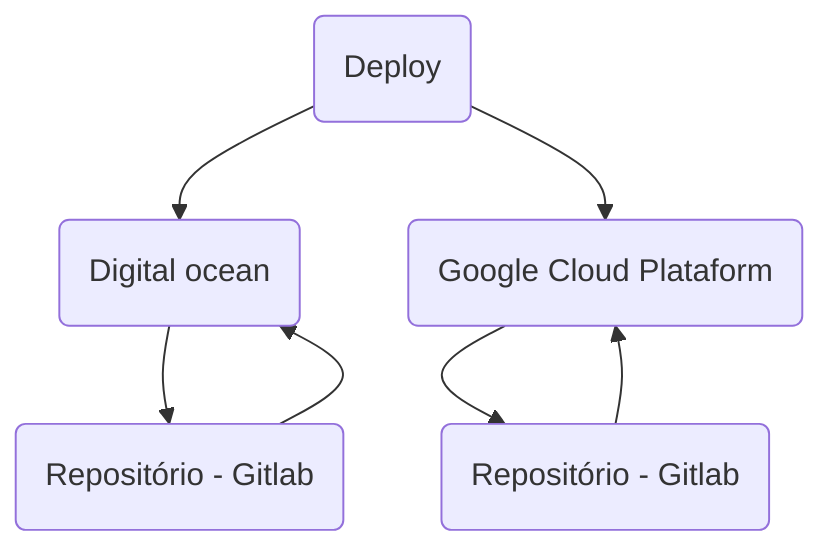

## Estudo prático deploy app Laravel com Deployer

<p align="center"></p>

## Resumo

### Estrutura de VM's em cloud:

#### [Digital Ocean (DO)](https://www.digitalocean.com)
 - VM deploy
  - Gerado ssh-keys (comunicação com server's de app (DO / GCP))
  - php7.0-cli (execução deployer)
  - GIT
  - [Deployer](https://deployer.org)
  - [Gitlab runner](https://docs.gitlab.com/runner)
  - Clonado cópia do **Laradep** (/home/gitlab-runner/deploy) que irá executar o deploy
 - VM aplicação
  - Add user deployer
  - Gerado ssh-keys (comunicação com servidor do repositório (gitlab))
  - Add permissão server deploy (authorized_keys)
  - Composer
  - GIT 
  - Nginx
  - PHPfpm
 
#### [Google Cloud Plataform (GCP)](https://cloud.google.com/)
 - VM de aplicação
  - Idem VM DO

### Fluxo de execução

- Gitlab runner dispara a execução no servidor de deploy (hospedado na DO)
- Acessa o diretório de deploy, atualiza a cópia da app referente a sua versão
- Executa o deployer no ambiente desejado (DO / GCP ou qualquer outro test / staging / prod) 
- O deployer acessa via ssh o servidor de aplição com o usuário de deploy
- Clona o repositório correspondente a versão do deploy dentro de suas releases (/var/www/html/laradep/releases) no path configurado no nginx
- Executa os comandos do arquivo **deploy.php** da raiz do projeto
- Faz o apontamento da current para a última release deployada



### Estrutura de diretórios da APP na VM
```
├── current -> releases/9
├── releases
│   ├── 7
│   │   ├── ...
│   ├── 8
│   │   ├── ...
│   └── 9
│       ├── app
│       ├── artisan
│       ├── bootstrap
│       ├── composer.json
│       ├── composer.lock
│       ├── ...
└── shared
    └── .env
    └── storage
        ├── app
        ├── framework
        └── logs
```

## VM's DO


## VM GCP


## Rodando

Force host(laradep.com) para o IP da APP da DO(159.89.184.227) ou GCP(35.231.28.88)


### Links
- [deploy.php](https://gitlab.com/adhenawer/laradep/blob/master/deploy.php)
- [gitlab-ci.yml](https://gitlab.com/adhenawer/laradep/blob/master/deploy.php)
- [pipeline](https://gitlab.com/adhenawer/laradep/pipelines/21243564)
- [Tutorial completo](https://www.digitalocean.com/community/tutorials/automatically-deploy-laravel-applications-deployer-ubuntu)